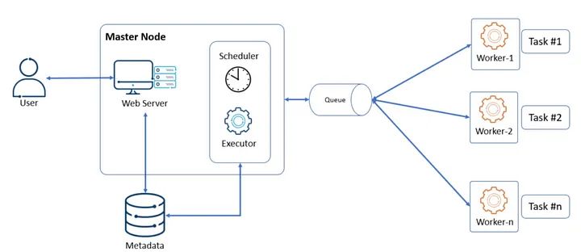

**Catchup and Backfilling in Apache Airflow: An Example**

In Apache Airflow, the concepts of **catchup** and **backfilling** are important when dealing with schedules and historical data. Here’s an example to illustrate these concepts.

### Scenario:
You have a DAG that runs daily and processes data from the previous day. You want to enable catchup to ensure that if the DAG is paused or missed, it will automatically run for any missed days when resumed.

### 1. Define the DAG with Catchup Enabled

Let’s start by defining a DAG that has catchup enabled.

```python
from airflow import DAG
from airflow.operators.dummy import DummyOperator
from airflow.utils.dates import days_ago
from datetime import timedelta

# Define default_args
default_args = {
    'owner': 'airflow',
    'depends_on_past': False,
    'email_on_failure': False,
    'email_on_retry': False,
    'retries': 1,
    'retry_delay': timedelta(minutes=5),
}

# Define the DAG
dag = DAG(
    'example_catchup_backfill',
    default_args=default_args,
    description='An example DAG demonstrating catchup and backfilling',
    schedule_interval=timedelta(days=1),
    start_date=days_ago(5),  # Start 5 days ago
    catchup=True,  # Enable catchup
    max_active_runs=1,  # Only one instance of the DAG will run at a time
)

# Define tasks
start = DummyOperator(
    task_id='start',
    dag=dag,
)

end = DummyOperator(
    task_id='end',
    dag=dag,
)

start >> end
```

### Explanation:
- **start_date**: The DAG will attempt to run starting from this date. With `days_ago(5)`, the DAG is set to start 5 days ago.
- **catchup=True**: This enables catchup, meaning that if the DAG is resumed after being paused, Airflow will backfill the DAG for the dates it missed based on the `start_date` and `schedule_interval`.
- **max_active_runs=1**: This ensures that only one DAG run is active at a time.

### 2. Running the DAG with Catchup Disabled

Now, if you want to disable catchup and only run the DAG for the current day, you can set `catchup=False`.

```python
dag = DAG(
    'example_catchup_backfill',
    default_args=default_args,
    description='An example DAG without catchup and no backfilling',
    schedule_interval=timedelta(days=1),
    start_date=days_ago(5),
    catchup=False,  # Disable catchup
    max_active_runs=1,
)
```

### 3. Triggering Backfill Manually

You can also manually trigger a backfill for a specific date range. Use the `airflow dags backfill` command:

```bash
airflow dags backfill -s 2023-08-01 -e 2023-08-05 example_catchup_backfill
```

- **-s**: Start date for backfilling.
- **-e**: End date for backfilling.
- **example_catchup_backfill**: The name of the DAG.

This command triggers the DAG to run for each day between August 1, 2023, and August 5, 2023.

### Summary:
- **Catchup** ensures that missed DAG runs are executed once the DAG is resumed.
- **Backfilling** can be done manually for specific date ranges using the Airflow CLI.

This example should give you a solid foundation on how to use catchup and backfilling in Apache Airflow.