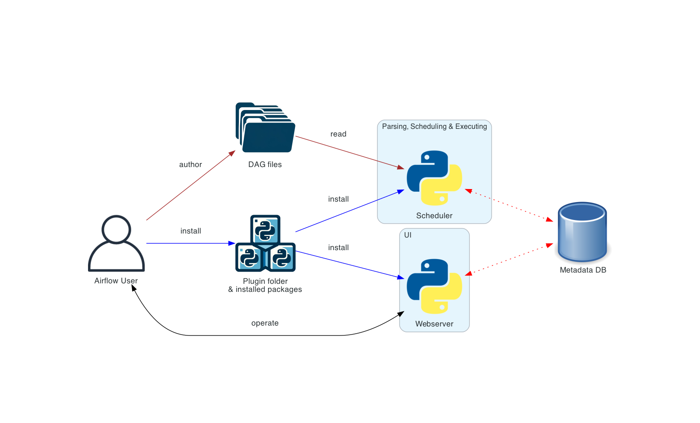

# Airflow process
[airflow standalone](https://harshalpagar.medium.com/running-airflow-with-docker-on-developer-environment-9c1c9559668c)

[airflow crontab guru](https://crontab.guru/)

[Idempotencia](https://medium.com/@chanon.krittapholchai/apache-airflow-useful-practices-idempotent-dag-6d52b1594704)

- Cuando los inputs son los mismos  -> el output siempre debe ser el mismo.
- Cuando no pasa un indempotencia -> cuando hay un stream 

- Componentes principales de airflow
    

    * A scheduler, which handles both triggering scheduled workflows, and submitting Tasks to the executor to run. The executor, is a configuration property of the scheduler, not a separate component and runs within the scheduler process. There are several executors available out of the box, and you can also write your own.

    * A webserver, which presents a handy user interface to inspect, trigger and debug the behaviour of DAGs and tasks.

    * A folder of DAG files is read by the scheduler to figure out what tasks to run and when and to run them.

    * A metadata database, which airflow components use to store state of workflows and tasks. Setting up a metadata database is described in Set up a Database Backend and is required for Airflow to work.

- [DAG AIRFLOW](https://airflow.apache.org/docs/apache-airflow/stable/core-concepts/dags.html)

- [DAG AIRFLOW DOCKER COMPOSE](https://airflow.apache.org/docs/apache-airflow/stable/howto/docker-compose/index.html)

- [TASK DEPENDENCIES](https://www.astronomer.io/docs/learn/managing-dependencies)